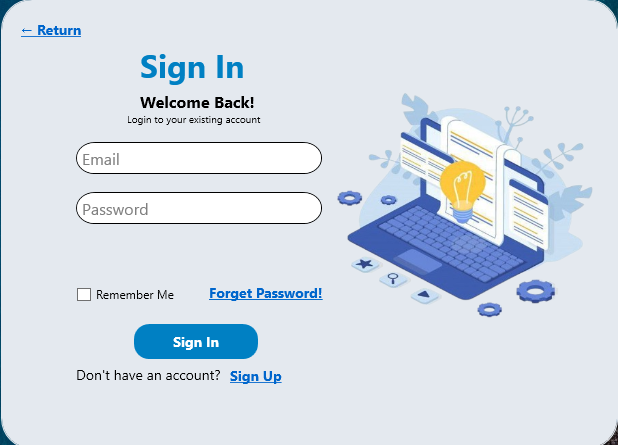
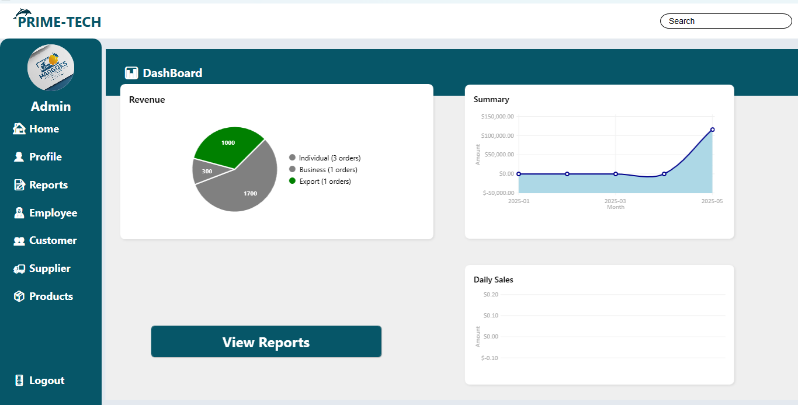
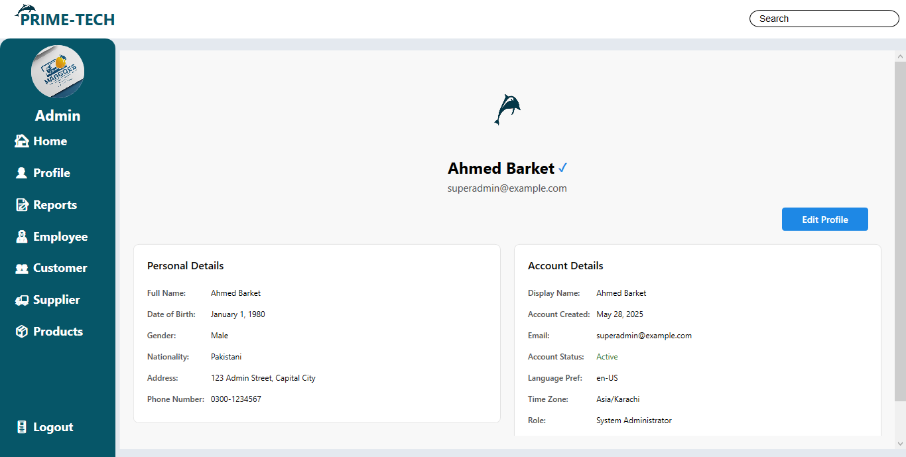
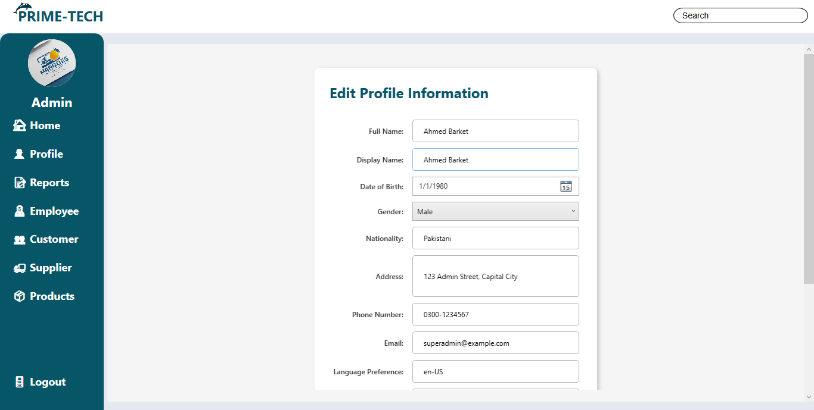
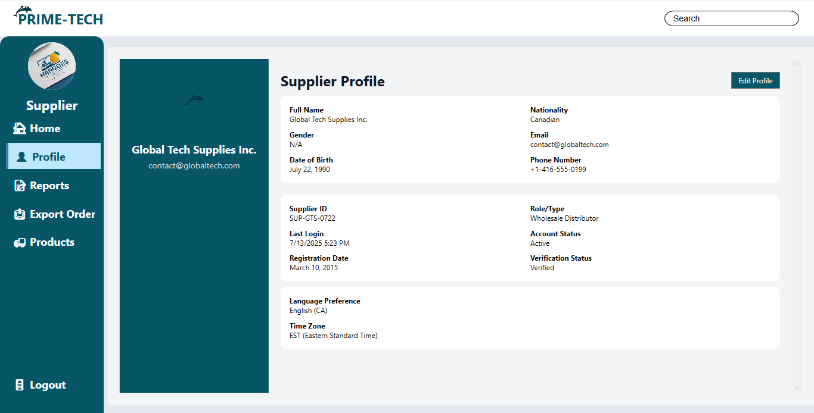
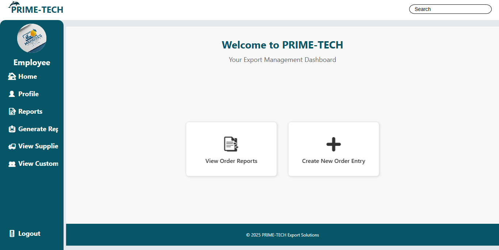
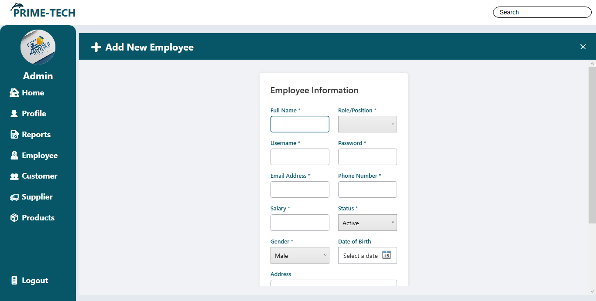
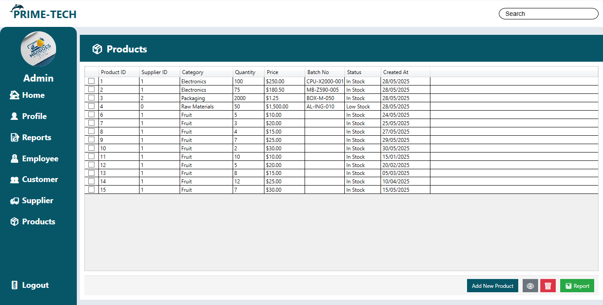
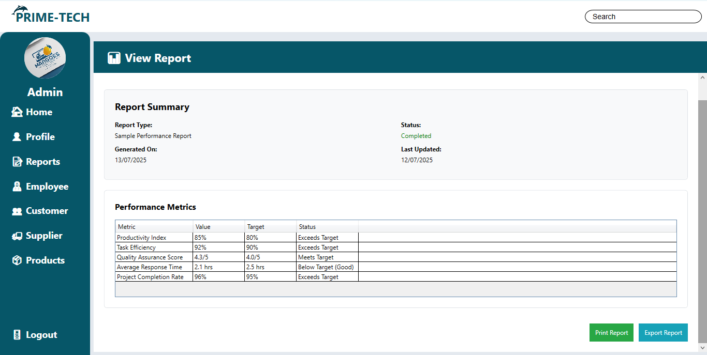
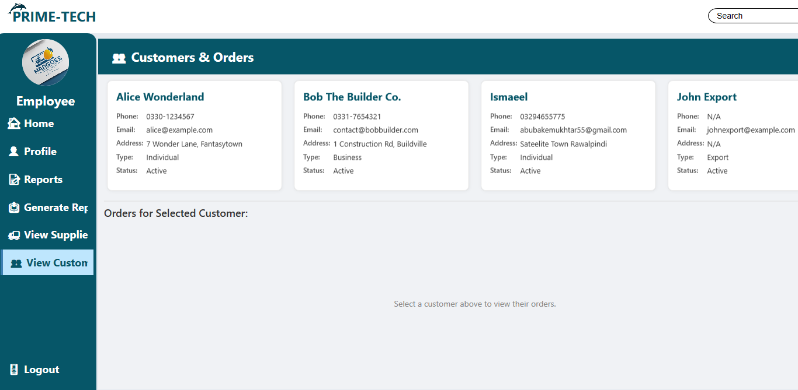

#  Prime Tech Management System (PTMS)

---
A professional-grade desktop system designed exclusively for Prime Tech to manage and streamline export operations between Pakistan and Iran.
Built for performance. Tailored for real-world trade.

---

# **System Screenshots**
---

<!-- Interface Previews -->

<em>Smooth and modern welcome interface with premium styling</em>

---

<strong>Secure Authentication Portal with Role-based Access</strong>

---

<em>Administrator control panel for managing system-wide activities, employee access, and operations</em>

---

<em>Personalized user profile with activity overview</em>

---

<em>Modern UI for profile updates and settings adjustment</em>

---

<em>Supplier module to add, manage, and export products, handle customers, and maintain profiles</em>

---

<em>Clean and structured supplier profile with real-time product linkage</em>

---

<em>Manage employee data with editable profiles and role-based assignment</em>

---

<em>Intuitive interface to view and edit user profiles seamlessly</em>

---

<em>Full-featured CRUD system for Create, Read, Update, and Delete operations</em>

---

<em>Auto-generated visual and tabular reports – export-ready and time-stamped</em>

---

<em>Quick-view panel to inspect entries, summaries, and database records</em>

---

## 🎯 Overview

**PTMS (Prime Tech Management System)** is a WPF-based desktop application tailored to manage and streamline export logistics for Prime Tech — a company exporting premium mangoes from Pakistan to Iran. The system empowers the business owner (Admin), certified suppliers, and a reporting employee to efficiently coordinate the export supply chain, generate insightful reports, and maintain secure records.

### 🚀 Key Objectives

* **Centralize Export Operations** — Manage all supplier activity and shipment status in one place
* **Streamline Communication** — Role-based access and responsibilities for admin, suppliers, and employees
* **Monitor Supplier Performance** — Generate automated PDF reports based on supplier ratings
* **Secure Data Handling** — Role-based login with email verification
* **Real-time Reporting** — Day-to-day export tracking and activity logs

---

## ✨ Key Features

* 🔐 Role-based Authentication (Admin / Supplier / Employee)
* 🧑‍💼 Supplier Database Management
* 📦 Export Tracking & Records
* 📝 Automated Report Generation (PDF)
* 📈 Supplier Performance Ratings
* 📬 Email Verification via SMTP (Gmail)
* 📊 Visual Dashboards with LiveCharts
* 🌐 English Language Support

---

## 🔧 Technology Stack

* **Frontend:** WPF (.NET, XAML)
* **Backend:** C# (.NET Framework)
* **Database:** MySQL
* **Authentication:** SMTP with Gmail
* **Reporting:** QuestPDF (PDF), basic CSV support
* **Charts:** LiveCharts.WPF
* **Packages Used:**

  * `MySql.Data`
  * `QuestPDF`
  * `LiveCharts.Wpf`
  * `System.Net.Mail`

---

## 👥 User Roles

### 🧑‍💼 Admin (Owner)

* View supplier performance
* Track shipment reports
* Oversee full system activity

### 🚛 Supplier

* Add and manage export product details
* Handle logistics and delivery to Iran
* Manage customer information and ratings
* Monitor shipment status and feedback

### 📊 Employee

* Enter/export shipment data
* Generate and export reports
* Rate suppliers day-wise

---

## 📈 Reporting & Analytics

* 📄 Daily Reports on Shipment Volume
* ⭐ Supplier Rating Reports
* 🧾 Printable PDF Exports
* 📊 Graphical Analysis using LiveCharts

---

## 🔒 Security Features

* Role-based Authentication
* Secure login system (email + password)
* SMTP Verification for email
* Encrypted storage (MySQL)

---

## 📌 Credits

Developed with dedication for **Prime Tech** as part of an academic capstone project.

> This system was developed solely for learning and demonstration purposes — not for commercial use or deployment.

### 👥 Collaborators

- [@MAFA-KHAN](https://github.com/MAFA-KHAN) 
- [@ismeelkhan1469](https://github.com/ismeelkhan1469)
- [@unfav-baker](https://github.com/unfav-baker)

---

